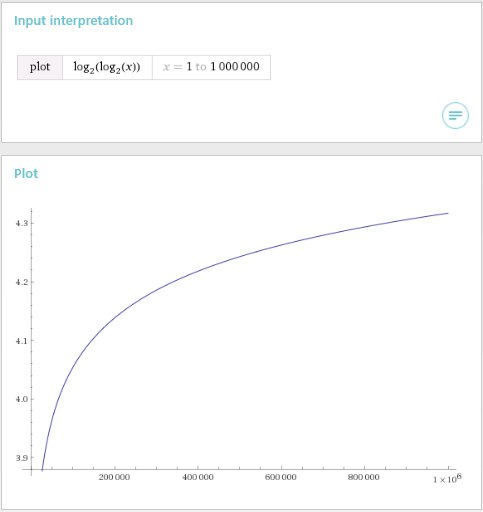
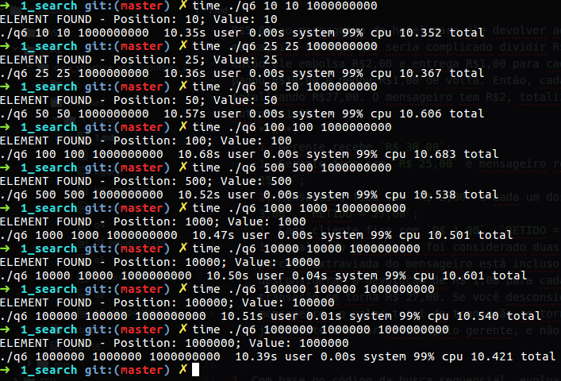

**Aluno**: Jonathan Henrique Maia de Moraes (12/0122553)
**Aluno**: Laércio (/)
**Disciplina**: Estrutura de Dados e Algoritmos 2
**Professor**: Maurício Serrano
**Data**: 03/04/2017

# Lista 1

1. Três músicos, João, Antônio e Francisco, tocam harpa, violino e piano. Contudo, não se sabe quem toca o quê. Sabe-se que o Antônio não é o pianista. Mas o pianista ensaia sozinho na Terça. O João ensaia com o Violoncelista às Quintas. Quem toca o quê?
	* **R**:
		1. `Antônio != pianista`, logo:
			* `Antônio == violoncelista OR harpista`;
		1. `João != pianista AND violoncelista`, logo:
			* `João == harpista`;
			* `Antônio == violoncelista`;
			* `Francisco == pianista`.

1. No antigo Egito, havia um prisioneiro numa cela com duas saídas, cada uma delas com um guarda. Cada saída dava para um corredor diferente em que um dava para o campo e, portanto, para a liberdade e o outro para um fosso de crocodilos. Só os guardas sabiam qual a saída certa, mas um deles dizia sempre a verdade e outro mentia sempre. O prisioneiro não sabia nem qual a saída certa nem qual o guarda que dizia a verdade. Qual a pergunta (e uma só pergunta) que o prisioneiro deveria fazer a um dos guardas ao acaso, para saber qual a porta certa?
	* **R**: O que o guarda ao lado responderá se eu perguntar qual corredor dá para o fosso?
		1. Se o guarda que perguntei for o que diz a verdade ele responderá o corredor para o campo, pois o que mente certamente mentiria qual corredor leva ao fosso;
		1. Se o guarda que perguntei for o que mente, ele responderá o corredor para o campo pois o que fala a verdade certamente diria qual corredor leva ao fosso.

1. Três pessoas se registram em um hotel. Elas pagam R$30,00 ao gerente e vão para seus quartos. O gerente nota que a diária é de R$25,00 e entrega R$5,00 ao mensageiro do hotel para ele devolver aos hóspedes. No caminho, o mensageiro conclui que seria complicado dividir R$5,00 entre 3 pessoas, então ele embolsa R$2,00 e entrega R$1,00 para cada pessoa. Agora, cada um pagou R$10,00 e pegou R$1,00 de volta. Então, cada um pagou R$9,00, totalizando R$27,00. O mensageiro tem R$2, totalizando R$29. Onde está o outro R$1,00?
	* **R**:
		1. Gerente recebe `R$ 30,00`;
		1. Gerente fica com `R$ 25,00` e mensageiro recebe `R$ 5,00`. `RETIDO = 25,00`;
		1. Mensageiro fica com `R$ 2,00` e cada um dos clientes recebem `R$ 3,00`. `RETIDO = 27,00`;
		1. Cada cliente fica com `R$ 1,00`. `RETIDO = R$ 30,00`.
		1. O valor do mensageiro foi considerado duas vezes no enunciado, pois a parcela extraviada do mensageiro está incluso nos R$ 27,00 pago. Se você desconsiderar a devolução de R$ 1,00 para cada cliente, o valor total de transação se torna R$ 27,00. Se você desconsiderar o extravio do mensageiro, o valor total de transação se torna R$ 25,00, que é justamente o valor retido pelo gerente, e não R$ 29,00.

1. Com base no código da busca sequencial, evolua o código para uma busca sequencial com índice primário.
	* **R**: Código completo no arquivo `q4_sequential.cpp`

	```C++
	/*
	 * Find the primary index based on search value
	 */
	int find_primary_index(vector<long long> &primary_indexes,
		long long search_value)
	{
		int index = 0;
		const int SIZE_OF_PRIMARY_INDEXES = primary_indexes.size();
		bool search_value_is_lesser_or_equals_element = false;

		// Search the minimum element greater or equals than the search value
		while(!search_value_is_lesser_or_equals_element
			&& index < SIZE_OF_PRIMARY_INDEXES)
		{
			if(search_value <= primary_indexes[index])
			{
				search_value_is_lesser_or_equals_element = true;
			}
			else
			{
				++index;
			}
		}

		// Correct the index
		if(index > 1)
		{
			if(index < SIZE_OF_PRIMARY_INDEXES-1)
			{
				// Primary index is between 2 ~ n
				// The first -1 is to get the previous index
				// The second -1 is to correct the index (which starts at 0)
				index = (index-1)*PRIMARY_INDEX_RATIO-1;
			}
			else
			{
				// Primary index is the last index
				// The -2 is to get the previous index with index correction
				// The -1 is to correct the index (which starts at 0)
				index = (SIZE_OF_PRIMARY_INDEXES-2)*PRIMARY_INDEX_RATIO-1;
			}
		}
		else
		{
			// Primary index is 0 or 1, index must be the first
			index = 0;
		}

		return index;
	}

	/*
	 * Perform the Sequential Search, Initiating from the index
	 * defined by the Primary Index Table
	 */
	int sequential_search(vector<long long> &sorted_elements,
		long long search_value, int initial_index)
	{
		int index;
		const int SIZE_OF_SORTED_ELEMENTS = sorted_elements.size();

		// Search the value with start index defined by the primary index table
		for(index = initial_index; index < SIZE_OF_SORTED_ELEMENTS; ++index)
		{
			if(sorted_elements[index] == search_value)
			{
				// The value was found
				return index;
			}

			if(sorted_elements[index] > search_value)
			{
				// The element is bigger than the value,
				// so the value could not be found
				return NOT_FOUND;
			}
		}

		// The element was not found
		return NOT_FOUND;
	}
	```

1. Com base no código da busca binária, desenvolva a mesma idéia em uma lista em anel.
	* **R**: Código completo no arquivo `q5_circular_binary.cpp`

	```C++
	/*
	 * Perform the Circular Binary Search
	 * Inspired from: https://youtu.be/uufaK2uLnSI
	 */
	int circular_binary_search(vector<long long> &circular_list,
		long long search_value)
	{
		int index = 0;

		unsigned int low_index = 0;
		unsigned int high_index = circular_list.size()-1;
		bool has_not_found = true;

		// Search the value
		while(low_index <= high_index && has_not_found)
		{
			// The element evaluated will always be the
			// half element between the lowest index and the highest index
			const int HALF_INDEX = (low_index + high_index) / 2;
			if(search_value == circular_list[HALF_INDEX])
			{
				// The half element has the same value than the search value
				index = HALF_INDEX;
				has_not_found = false;
			}
			else if(circular_list[HALF_INDEX] <= circular_list[high_index])
			{
				// The right half of the list is sorted with the half element
				if(search_value > circular_list[HALF_INDEX]
					&& search_value <= circular_list[high_index])
				{
					// The search value can only be in the right sorted
					// half of the list
					low_index = HALF_INDEX+1;
				}
				else
				{
					// The search value can only be in the left half of the list
					high_index = HALF_INDEX-1;
				}
			}
			else
			{
				// The left half of the list is sorted with the half element
				if(search_value >= circular_list[low_index]
					&& search_value < circular_list[HALF_INDEX])
				{
					// The search value can only be in the left sorted
					// half of the list
					high_index = HALF_INDEX-1;
				}
				else
				{
					// The search value can only be in the right half of the list
					low_index = HALF_INDEX+1;
				}
			}
		}

		// The search could not find the desired value
		if(has_not_found)
		{
			index = NOT_FOUND;
		}

		return index;
	}
	```

1. Modifique o código da busca binária, trocando o cálculo dos índices inferiores e superiores de modo a obter uma busca por interpolação. Utilize o cálculo dado em sala. Teste o tempo gasto pela busca para encontrar um valor em um vetor de 10, 25, 50, 100, 500, mil, dez mil, cem mil e um milhão de posições. A taxa de crescimento é ou não é da ordem de log(log(n))?
	* **R**: Código completo no arquivo `q6_interpolation.cpp`

	```C++
	/*
	 * Perform the Interpolation Search
	 */
	int interpolation_search(vector<long long> &sorted_elements,
		long long search_value)
	{
		int index = 0;

		unsigned int low_index = 0;
		unsigned int high_index = sorted_elements.size()-1;
		bool has_not_found = true;

		// Search the value
		while(low_index <= high_index && has_not_found)
		{
			// Interpolation Equation
			const int MID_INDEX = low_index +
				((high_index - low_index) *
					((search_value - sorted_elements[low_index])
						/ (sorted_elements[high_index] - sorted_elements[low_index])));

			if(search_value == sorted_elements[MID_INDEX])
			{
				// The half element has the same value than the search value
				index = MID_INDEX;
				has_not_found = false;
			}
			else if(search_value > sorted_elements[MID_INDEX])
			{
				// The search value should be in the right half of the list
				low_index = MID_INDEX + 1;
			}
			else
			{
				// The search value should be in the left half of the list
				high_index = MID_INDEX - 1;
			}
		}

		// The search could not find the desired value
		if(has_not_found)
		{
			index = NOT_FOUND;
		}

		return index;
	}
	```

	* Foi considerado o caso de teste de extremo: O valor pesquisado é sempre o último elemento da lista. É possível identificar claramente a eficiência do algoritmo, muito próximo do comportamento constante de uma função `log(log(x))` (como consta na [figura 1.1](figures/1.jpg)) Para calcular o tempo médio, foi utilizado da metodlogia do _loop_ de estresse na escala de 1 bilhão. Os resultados podem ser vistos na [figura 1.2](figures/2.png) e na tabela abaixo:

| Tamanho da Lista | Valor Pesquisado | Resultado Real | Resultado Unidade |
|:----------------:|:----------------:|:--------------:|:-----------------:|
| 10 | 10 | 10.35s | ~104 ns |
| 25 | 25 | 10.36s | ~104 ns |
| 50 | 50 | 10.57s | ~106 ns |
| 100 | 100 | 10.68s | ~107 ns |
| 500 | 500 | 10.52s | ~106 ns |
| 10^3 | 10^3 | 10.47s | ~105 ns |
| 10^4 | 10^4 | 10.50s | ~105 ns |
| 10^5 | 10^5 | 10.51s | ~105 ns |
| 10^6 | 10^6 | 10.39s | ~104 ns |




