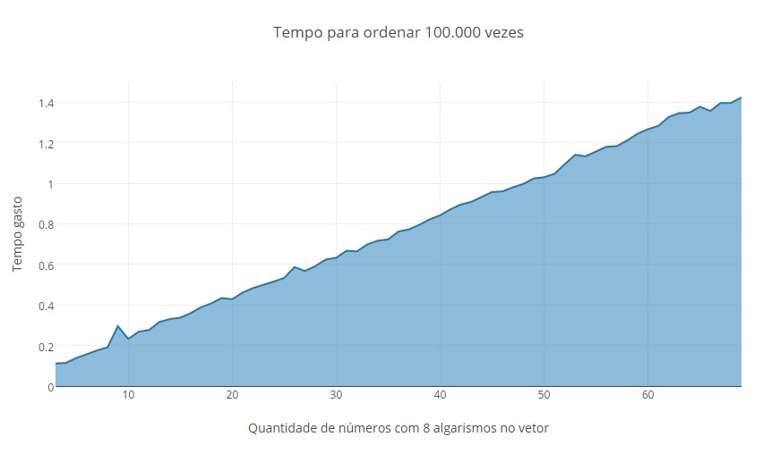

Radix Sort com Count Sort análise de tempo/complexidade

O problema implementado ordena 100.000 vezes um vetor com números de 8
algarismos de 2 a 69 números.

Para compilar: g++ radix_counting.cpp -o radix_counting
Para executar extraindo a saída: ./radix_counting >> timing.txt

Os arquivos out.txt e timing.csv, são as fontes de dados da análise, arquivos
nos quais gerados apartir da saída do programa. Sendo que o csv foi gerado por
regex para que fosse possível plotar gráficamente a respota.

| Tamanho do vetor | Quantidade de algarismos | Quantidade de loops | Resultado Real |
|:----------------:|:------------------------:|:-------------------:|:--------------:|
| 2 | 8 | 100.000 | ~ 0.087429 s |
| 10 | 8 | 100.000 | ~ 0.232410 s |
| 20 | 8 | 100.000 | ~ 0.428285 s |
| 40 | 8 | 100.000 | ~ 0.871409 s |
| 60 | 8 | 100.000 | ~ 1.266360 s |
| 69 | 8 | 100.000 | ~ 1.423326 s |

Nota-se que o gráfico possui uma taxa de crescimento linear. Equivalente ao
algoritmo Radix Sort com Count Sort, que possui O(n).

Referência bibliográfica:
http://www.geeksforgeeks.org/radix-sort/
