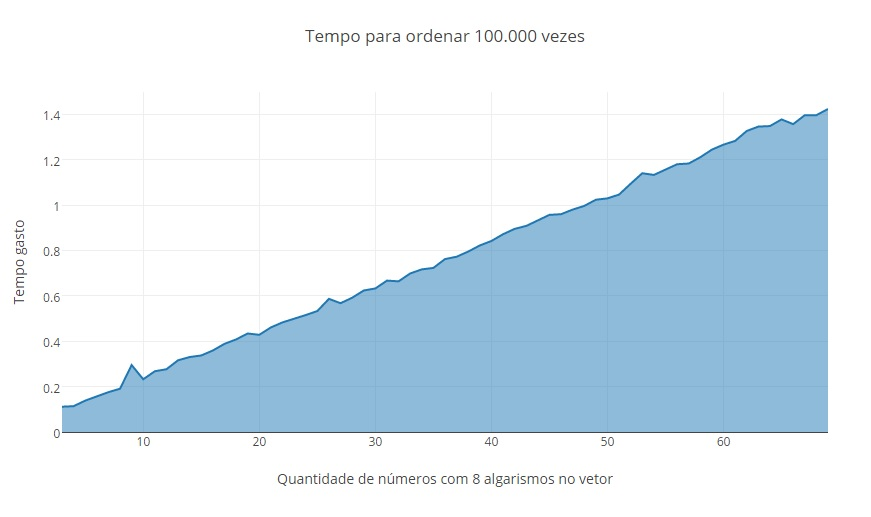

**Aluno**: Jonathan Henrique Maia de Moraes (12/0122553)

**Aluno**: Laércio (13/0119105)

**Disciplina**: Estrutura de Dados e Algoritmos 2

**Professor**: Maurício Serrano

**Data**: 10/04/2017

# Lista 2
1. The Islanders  
There are two beautiful yet remote islands in the south pacific. The Islanders born on one island always tell the truth, and the Islanders from the other island always lie.
You are on one of the islands, and meet three Islanders. You ask the first which island they are from in the most appropriate Polynesian tongue, and he indicates that the other two Islanders are from the same Island. You ask the second Islander the same question, and he also indicates that the other two Islanders are from the same island.
Can you guess what the third Islander will answer to the same question? How?  
Resposta:  
O terceiro "Islander" falou que pertence a mesma ilha dos outros dois. Por meio
das seguintes deduções(V- se refere a ilha que falam a verdade, M- A que falam a
mentira):  
O primeiro falou que os outros dois(1 e 2) pertencem a mesma ilha (V ou M). Ele pode estar falando a verdade ou pode estar mentido. O segundo falou a mesma coisa do primeiro, que os outros dois (3 e 1) pertencem a mesma ilha (V ou M). Mas ele também pode estar mentindo ou falando a verdade.
Implicações: o primeiro fala a verdade ou mentira, mas ele fala na mesma categoria do segundo. Ou seja, se o primeiro fala a verdade, o segundo também fala, ou se o primeiro fala a mentira. O terceiro é implicação lógica dos dois primeiros. Se ambos falam a verdade o terceiro também falará, se ambos falam a mentira o terceiro também falará. Logo o terceiro falará a mesma coisa que os antecessores.

1. Two Strings  
You have two strings whose only known property is that when you light one end of either string it takes exactly one hour to burn. The rate at which the strings will burn is completely random and each string is different.   
How do you measure 45 minutes?  
Resposta:  
Se caso a pessoa queimar as duas extremidades da primeira corda ao mesmo tempo, quando a corda estiver totalmente queimada terá se passado meia hora, visto que ela demora 1 hora para queima com uma chama em apenas uma extremidade.
Se caso a pessoa acender apenas uma extremidade da corda ao mesmo tempo que acendeu as duas extremidades da primeira corda. A primeira corda não existirá, a segunda corda terá queimado o equivalente a meia hora, se caso acender a outra
 extremidade da segunda corda ser queimada no mesmo momento que a primeira corda tiver sido totalmente queimada, no memonto exato que a segunda corda terminar de queimar terá se passado exatos 45 minutos.

1. The Greek Philosophers  
One day three Greek philosophers settled under the shade of an olive tree, opened a bottle of Retsina, and began a lengthy discussion of the Fundamental Ontological Question: Why does anything exist? After a while, they began to ramble. Then, one by one, they fell asleep.
While the men slept, three owls, one above each philosopher, completed their digestive process, dropped a present on each philosopher's forehead, the flew off with a noisy "hoot."

  * Resposta:

  O filósofo que parou de rir constatou que a única situação possível em que fizesse todos os três filósofos rirem sem parar seria se todos os três estivessem com o presente na cabeça."
Se só um estivesse com o presente, o presenteado não riria enquanto os outros dois ririam.
Se dois dos três estivessem com o presente, todos ririam, mas um dos presentados certamente perguntaria: "Porque ele está rindo se é ele que está presenteado?", e certamente pararia de rir.
Como todos os três riram, e nenhum deles pararam de rir, o filósofo concluiu que ele certamente estava presenteado.

1. Imagine um vetor onde o menor elemento está na última posição. Explique (use um diagrama de um vetor com 11 posições) como o Shellsort garante que esse elemento conseguirá chegar à sua posição final através de trocas sucessivas baseadas no gap.
  * Resposta:  

  ```
  Vetor desordenado: 20 10 9 15 17 8 2 21 19 3 1
  N = 11/2 = 5.
  O N é o número do tamanho do vetor dividido por n^i, sendo i, a quantidade de iterações começando em 1.
  ----------------------------
  20 10 9 15 17 8 2 21 19 3 1
  ↑__________↑-TROCOU
  17 10 9 15 20 8 2 21 19 3 1
     ↑__________↑-TROCOU
  17 8 9 15 20 10 2 21 19 3 1
       ↑__________↑-TROCOU
  17 8 2 15 20 10 9 21 19 3 1
         ↑__________↑
  17 8 2 15 20 10 9 21 19 3 1
            ↑__________↑-TROCOU
  17 8 2 15 19 10 9 21 20 3 1
               ↑__________↑-TROCOU
  17 8 2 15 19 3 9 21 20 10 1
                 ↑__________↑-TROCOU
  17 8 2 15 19 3 1 21 20 10 9
  ----------------------------
  N = 11/4 = 2.
  Segunda interação, ou seja, i = 2. 2^2 = 4
  ----------------------------
  17 8 2 15 19 3 1 21 20 10 9
  ↑____↑-TROCOU
  2 8 17 15 19 3 1 21 20 10 9
    ↑____↑
  2 8 17 15 19 3 1 21 20 10 9
      ↑_____↑
  2 8 17 15 19 3 1 21 20 10 9
         ↑_____↑-TROCOU
  2 8 17 3 19 15 1 21 20 10 9
           ↑_____↑-TROCOU
  2 8 17 3 1 15 19 21 20 10 9
             ↑_____↑
  2 8 17 3 1 15 19 21 20 10 9
                ↑_____↑
  2 8 17 3 1 15 19 21 20 10 9
                   ↑_____↑-TROCOU
  2 8 17 3 1 15 19 10 20 21 9
                      ↑_____↑-TROCOU
  2 8 17 3 1 15 19 10 9 21 20
  ----------------------------
  N = 11/8 = 1.
  Terceira interação, ou seja, i = 3. 2^3 = 8.
  Nessa interação que o N = 1, ela é recursiva até que não exista trocas com o antecessor.
  ----------------------------
  2 8 17 3 1 15 19 10 9 21 20
  ↑_↑
  2 8 17 3 1 15 19 10 9 21 20
    ↑_↑
  2 8 17 3 1 15 19 10 9 21 20
      ↑_↑-TROCOU
  2 8 3 17 1 15 19 10 9 21 20
    ↑_↑-TROCOU
  2 3 8 17 1 15 19 10 9 21 20
  ↑_↑
  2 3 8 17 1 15 19 10 9 21 20
        ↑__↑-TROCOU
  2 3 8 1 17 15 19 10 9 21 20
      ↑_↑-TROCOU
  2 3 1 8 17 15 19 10 9 21 20
    ↑_↑-TROCOU
  2 1 3 8 17 15 19 10 9 21 20
  ↑_↑
  1 2 3 8 17 15 19 10 9 21 20
          ↑__↑-TROCOU
  1 2 3 8 15 17 19 10 9 21 20
             ↑__↑
  1 2 3 8 15 17 19 10 9 21 20
                ↑__↑-TROCOU
  1 2 3 8 15 17 10 19 9 21 20
             ↑__↑-TROCOU
  1 2 3 8 15 10 17 19 9 21 20
          ↑__↑-TROCOU
  1 2 3 8 10 15 17 19 9 21 20
        ↑_↑
  1 2 3 8 10 15 17 19 9 21 20
                   ↑__↑-TROCOU
  1 2 3 8 10 15 17 9 19 21 20
                ↑__↑-TROCOU
  1 2 3 8 10 15 9 17 19 21 20
             ↑__↑-TROCOU
  1 2 3 8 10 9 15 17 19 21 20
          ↑__↑-TROCOU
  1 2 3 8 9 10 15 17 19 21 20
        ↑_↑
  1 2 3 8 9 10 15 17 19 21 20
                     ↑__↑
  1 2 3 8 9 10 15 17 19 21 20
                        ↑__↑
  ----------------------------
  Vetor original desordenado:
  20 10 9 15 17 8 2 21 19 3 1
  Vetor ordenado:
  1 2 3 8 9 10 15 17 19 21 20

  Quantidade de passos: 40 Passos
  Quantidade de swaps: 24 Swaps
  ```
1. Implemente o algoritmo Quicksort em uma lista duplamente encadeada, trocando os elos e os structs de posição (não só apenas os valores). Escolha sempre o primeiro elemento como pivô.  
  * Resposta:

  ```
  //Limitações:
  //Não pega o pivo no inicio da lista, pega no final.
  //Swap não faz com endereço faz com o valor.
  #include <stdio.h>
  #include <stdlib.h>

  typedef struct node{
  	int chave;
  	struct node *prox;
  	struct node *ante;
  }node;

  typedef struct cabecalho{
  	struct node *inicio;
  	struct node *fim;
  	int quantidade;
  }cabecalho;

  int main(){

  	void cadastraFinal(cabecalho *cabecalho);
  	void imprimeListaNormal(cabecalho *cabecalho);
  	cabecalho *iniciaCabecalho();

  	void quickSort(struct node* l, struct node *h, struct cabecalho * cabecalho);
  	node *particao(node *l, node *h,struct cabecalho *cabecalho);

  	cabecalho *cabecalho = iniciaCabecalho();

  	int opcao;
  	do{
  			printf("\nmenu Cabecalho = %d\n", cabecalho->quantidade);
  			printf("\n1- Cadastrar no fim");
  			printf("\n2- Ver normal");
  			printf("\n3- Sair");
  			scanf("%d",&opcao);
  			switch(opcao){
  				case 1:{
  					cadastraFinal(cabecalho);
  					break;
  				}
  				case 2:{
  					imprimeListaNormal(cabecalho);
  					quickSort(cabecalho->inicio,cabecalho->fim, cabecalho);
  					printf("\nOrdenada:");
  					imprimeListaNormal(cabecalho);
  				}
  			}
  	}while(opcao != 3);

  	return 0;
  }

  cabecalho *iniciaCabecalho(){
  	cabecalho *cabecalho;
  	cabecalho = malloc(sizeof(cabecalho));
  	cabecalho->inicio = NULL;
  	cabecalho->fim = NULL;
  	cabecalho->quantidade = 0;

  	return cabecalho;
  }

  void swap ( node *a, node *b, struct cabecalho *cabecalho )
  {/*
  		if(a == cabecalho->inicio){
  			cabecalho->inicio = b;
  		}
  		if(b == cabecalho->inicio){
  			cabecalho->inicio = a;
  		}
  		node *aAnte = a->ante;
  	  node *bAnte = b->ante;
  		node *aProx = a->prox;
  		node *bProx = b->prox;
  		if(aAnte != NULL){
  			aAnte->prox = b;
  		}
  		if(bAnte != NULL){
  			bAnte->prox = a;
  		}
  		if(aProx != NULL){
  			aProx->ante = b;
  		}
  		if(bProx != NULL){
  			bProx->ante = a;
  		}
  		a->prox = bProx;
  		a->ante = bAnte;
  		b->prox = aProx;
  		b->ante = aAnte;*/

  		int t = a->chave;      a->chave = b->chave;       b->chave = t;
  }

  node* particao(node *l, node *h,struct cabecalho *cabecalho){
    int valor  = h->chave;
    node *i = l->ante;
  	node *aux = NULL;
  	node *j;

    for ( j = l; j != h; j = j->prox)
    {
      if (j->chave <= valor)
      {
          if(i == NULL){
  					i = l;
  				}else{
  					i = i->prox;
  				}
          swap(i, j, cabecalho);
      }
    }

  	if(i == NULL){
  		i = l;
  	}else{
  		i = i->prox;
  	}
    swap(i, h, cabecalho);

  	return i;
  }

  void quickSort(struct node* l, struct node *h, struct cabecalho * cabecalho)
  {
      if (h != NULL && l != h && l != h->prox)
      {
          struct node *p = particao(l, h, cabecalho);
          quickSort(l, p->ante, cabecalho);
          quickSort(p->prox, h, cabecalho);
      }
  }

  void cadastraFinal(cabecalho *cabecalho){
  	node *aux;

  	int chave;
  	aux = (node *) malloc(sizeof(node));

  	printf("\nDigite a chave");
  	scanf("%d",&chave);
  	aux->chave = chave;
  	if(cabecalho->quantidade == 0){
  		cabecalho->inicio = aux;
  		cabecalho->fim = aux;
  		aux->prox = NULL;
  		aux->ante = NULL;
  		cabecalho->quantidade++;
  	}
  	else{
  		aux->ante = cabecalho->fim;
  		cabecalho->fim->prox = aux;
  		cabecalho->fim = aux;
  		cabecalho->fim->prox= NULL;
  		cabecalho->quantidade++;
  	}
  }

  void imprimeListaNormal(cabecalho *cabecalho){
  	node *aux= cabecalho->inicio;

  	while(aux != NULL){
  		printf("\n Chave: %d", aux->chave);
  		aux = aux->prox;
  	}
  }
  ```  
1. Implemente o Heapsort das duas formas: o modo normal, que utiliza um único vetor, e a segunda forma, como uma estrutura separada onde a ordenação é feita inserindo todos os dados e depois removendo todos. Cronometre a execução e trace um gráfico. Qual a mais rápida? A taxa de crescimento é a mesma?

1. Implemente um algoritmo que misture o Counting sort e o Radix sort para ordenar um vetor de números com 8 algarismos. Cronometre a execução e trace um gráfico. A taxa de crescimento é mesmo linear?

  Radix Sort com Count Sort análise de tempo/complexidade

  O problema implementado ordena 100.000 vezes um vetor com números de 8
  algarismos de 2 a 69 números.

  Para compilar: g++ radix_counting.cpp -o radix_counting
  Para executar extraindo a saída: ./radix_counting >> timing.txt

  Os arquivos out.txt e timing.csv, são as fontes de dados da análise, arquivos
  nos quais gerados apartir da saída do programa. Sendo que o csv foi gerado por
  regex para que fosse possível plotar gráficamente a respota.

| Tamanho do vetor | Quantidade de algarismos | Quantidade de loops | Resultado Real |
|:----------------:|:------------------------:|:-------------------:|:--------------:|
| 2 | 8 | 100.000 | ~ 0.087429 s |
| 10 | 8 | 100.000 | ~ 0.232410 s |
| 20 | 8 | 100.000 | ~ 0.428285 s |
| 40 | 8 | 100.000 | ~ 0.871409 s |
| 60 | 8 | 100.000 | ~ 1.266360 s |
| 69 | 8 | 100.000 | ~ 1.423326 s |

  

  Nota-se que o gráfico possui uma taxa de crescimento linear. Equivalente ao
  algoritmo Radix Sort com Count Sort, que possui O(n).

  Referência bibliográfica:
  http://www.geeksforgeeks.org/radix-sort/
